# **Team Enterpernures**


## **Exploratory Data Analysis (CO2 Emissions from Different Countries)** 
Data Source: [Waste Disposal](https://github.com/Z-Unlocked/Unlocked_Challenge_1)

## **Introduction**
In recent years climate change & global warming has gained significant momentum. The one key sources of CO2 emissions has been from countries. In this project the CO2 emissions from all over countries will be investigated. 

## **About the Dataset:**

- Provided by the [HP Z-Unlocked Challenge](https://github.com/Z-Unlocked/Unlocked_Challenge_1), the dataset used in this EDA has records covering approx. 30 years from 1990 to 2020.  It holds a breakdown of CO2 emissions for a number of countries . As it will become apparent, CO2 emissions from country to country is increasing day by day and it is in inclined plan form.

## **Methodolgy:**
- First of all whole data was explored. Redundent Data was removed to simplify the analysis. There were no missing values however distribution of data is not evenly distributed due to multiple reasons i.e CO2 emission fluctuate in differents countries over years and years and different parts of the globe.
- We Divide our EDA into two parts.
  - Part 1 is EDA on whole data
  - Part 2 is EDA on Subcontinent Countries only
## **Part-1: EDA on Whole DataSet**

### **Step-1: Importing Libraries**

```python
import pandas as pd
import numpy as np
import matplotlib.pyplot as plt
import seaborn as sns
```
### **Step-2: Importing Dataset**

```python
df = pd.read_csv('waste_disposal_data_11-29-2021.csv')
df.head()
```
> **Output :**

 Domain Code Domain Area Code (ISO3) Area Element Code Element Item Code Item Year Code Year Unit Value Flag Flag Description
0 GW Waste Disposal AFG Afghanistan 7273 Emissions (CO2) 6990 Incineration 1990 1990 kilotonnes 0.0 Fc Calculated data
1 GW Waste Disposal AFG Afghanistan 7273 Emissions (CO2) 6990 Incineration 1991 1991 kilotonnes 0.0 Fc Calculated data
2 GW Waste Disposal AFG Afghanistan 7273 Emissions (CO2) 6990 Incineration 1992 1992 kilotonnes 0.0 Fc Calculated data
3 GW Waste Disposal AFG Afghanistan 7273 Emissions (CO2) 6990 Incineration 1993 1993 kilotonnes 0.0 Fc Calculated data
4 GW Waste Disposal AFG Afghanistan 7273 Emissions (CO2) 6990 Incineration 1994 1994 kilotonnes 0.0 Fc Calculated data


### **Step-3: Data Shape**
> Shape function tells us number of Observations and columns.
> In this dataset we have 14 columns and 46131 records or obervations
```python
row, col=df.shape
print('Total number of observations/rows/entries:', row)
print('Total number of columns:', col)
```
> **Output :**

```python
Number of Rows       =  6238
Number of Columns    =  14
```

### **Step-4: Data Structure**
> Extracting Basic Dataset Information: 
> - Our dataset contain 
>     - RangeIndex: 0 - to - 6238 
>     - Total Columns: 14 
>     - No of  Non-Null Values: Zero
>     - Dtypes: float64(1), int64(4), object(9) 
>     - memory usage: 682.4+ KB
```python
df.info()
```
> **Output :**

```python
<class 'pandas.core.frame.DataFrame'>
RangeIndex: 6238 entries, 0 to 6237
Data columns (total 14 columns):
 #   Column            Non-Null Count  Dtype  
---  ------            --------------  -----  
 0   Domain Code       6238 non-null   object 
 1   Domain            6238 non-null   object 
 2   Area Code (ISO3)  6238 non-null   object 
 3   Area              6238 non-null   object 
 4   Element Code      6238 non-null   int64  
 5   Element           6238 non-null   object 
 6   Item Code         6238 non-null   int64  
 7   Item              6238 non-null   object 
 8   Year Code         6238 non-null   int64  
 9   Year              6238 non-null   int64  
 10  Unit              6238 non-null   object 
 11  Value             6238 non-null   float64
 12  Flag              6238 non-null   object 
 13  Flag Description  6238 non-null   object 
dtypes: float64(1), int64(4), object(9)
memory usage: 682.4+ KB
```

### **Step-5: Finding Missing Values**
> DataSet is cleaned as far as missing values are concerned
```python
df.isnull().sum()
```
> **Output :**
```python
Domain Code         0
Domain              0
Area Code (ISO3)    0
Area                0
Element Code        0
Element             0
Item Code           0
Item                0
Year Code           0
Year                0
Unit                0
Value               0
Flag                0
Flag Description    0
dtype: int64
```
> DataSet is cleaned as far as missing values are concerned in percentage

```python
df.isnull().sum() / df.shape[0] * 100
```

> **Output :**

```python
Domain Code         0.0
Domain              0.0
Area Code (ISO3)    0.0
Area                0.0
Element Code        0.0
Element             0.0
Item Code           0.0
Item                0.0
Year Code           0.0
Year                0.0
Unit                0.0
Value               0.0
Flag                0.0
Flag Description    0.0
dtype: float64
```
### **Step-6: Summary Statistics**

```python
df.describe()
```
> **Output :**

 Element Code Item Code Year Code Year Value
count 6238.0 6238.0 6238.000000 6238.000000 6238.000000
mean 7273.0 6990.0 2004.677300 2004.677300 202.675467
std 0.0 0.0 8.603289 8.603289 1066.676986
min 7273.0 6990.0 1990.000000 1990.000000 0.000000
25% 7273.0 6990.0 1997.000000 1997.000000 0.000000
50% 7273.0 6990.0 2005.000000 2005.000000 0.652579
75% 7273.0 6990.0 2012.000000 2012.000000 30.517272
max 7273.0 6990.0 2019.000000 2019.000000 11151.696408


### **Step-7: Value Counts**

```python
df.Value.value_counts()
```
> **Output :**

```python
0.000000     2828
17.356301       1
17.343147       1
17.324444       1
17.311169       1
             ... 
47.010034       1
47.179100       1
47.292824       1
46.997779       1
35.841750       1
Name: Value, Length: 3411, dtype: int64

```python
# unique values in each column
df.nunique
> **Output :**

```python
Domain Code            1
Domain                 1
Area Code (ISO3)     217
Area                 217
Element Code           1
Element                1
Item Code              1
Item                   1
Year Code             30
Year                  30
Unit                   1
Value               3411
Flag                   2
Flag Description       2
dtype: int64
```
### **Step-8: Feature Selection**
1. Domain Code having GW  Global Warming value only
2. Domain having Waste disposal value only
3. Area Code (ISO3) codes of different countries
4. Area representing different countries
5. Element Code representing code of CO2 as seven thousand two hundred seventy-three (7273)
6. Element having only one value as Emissions (CO2)
7. Item Code representing items codes that are only one
8. Item representing Incineration  means the destruction of something in progress
9. Year Code representing different years codes
10. Year representing different years
11. Unit representing only one value kilotons
12. Value representing the number of CO2 emissions in unit kilotons
13. Flag representing flag short name that is only two
14. Flag Description represents two types of description over the flag
## **Clean data - exclude unnecessary data improved readability**
```python
df.drop(['Domain Code', 'Domain', 'Element Code', 'Element', 'Item Code', 'Item', 'Unit','Flag','Flag Description'], axis=1, inplace=True)
```

## **Label encoding to get a clear picture of data**
There are some columns which are not in use but to get a really clear picture lets use those as well.
```python
from sklearn.preprocessing import LabelEncoder
label = LabelEncoder()
df['Domain'] = label.fit_transform(df['Domain'])
df['Domain Code'] = label.fit_transform(df['Domain Code'])
df['Area Code (ISO3)'] = label.fit_transform(df['Area Code (ISO3)'])
df['Area'] = label.fit_transform(df['Area'])
df['Element'] = label.fit_transform(df['Element'])
df['Item'] = label.fit_transform(df['Item'])
df['Unit'] = label.fit_transform(df['Unit'])
df['Flag'] = label.fit_transform(df['Flag'])
df['Flag Description'] = label.fit_transform(df['Flag Description'])
```


### **Step-9: Distribution of Data**
> The data is extremely broadly distributed with many values in the range of 0 to 8.415818 with a strong skew to the right and kurtosis as 0 to 75.170198.

#### **Before removing outliers**

#### **After removing outliers**
#### **With Interquartile range technique**
##### **there are some outliers so we are going to taking those off from data set**
```pyhton
def mod_outlier(df):
    col_vals = df.columns
    df1 = df.copy()
    df = df._get_numeric_data()

    q1 = df.quantile(0.25)
    q3 = df.quantile(0.75)

    iqr = q3 - q1

    lower_bound = q1 - (1.5 * iqr)
    upper_bound = q3 + (1.5 * iqr)
    for col in col_vals:
        for i in range(0, len(df[col])):
            if df[col][i] < lower_bound[col]:
                df[col][i] = lower_bound[col]

            if df[col][i] > upper_bound[col]:
                df[col][i] = upper_bound[col]

    for col in col_vals:
        df1[col] = df[col]

        return(df1)
```

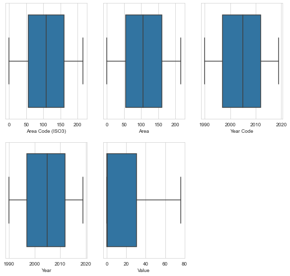

## **Step-9: Visualization of Data**
#### **Visualization of CO2 emissions over the years**

#### Before label encoding and outlier removal

```python
# Data Distribution by top 30 countries
a = df.groupby(["Area"]).sum().sort_values(
    by=["Value"], ascending=False).head(30)
a
plt.figure(figsize=(5, 3), dpi=150, linewidth=2)
sns.barplot(x=a.index, y='Value', data=a)
plt.xticks(rotation=90)
```

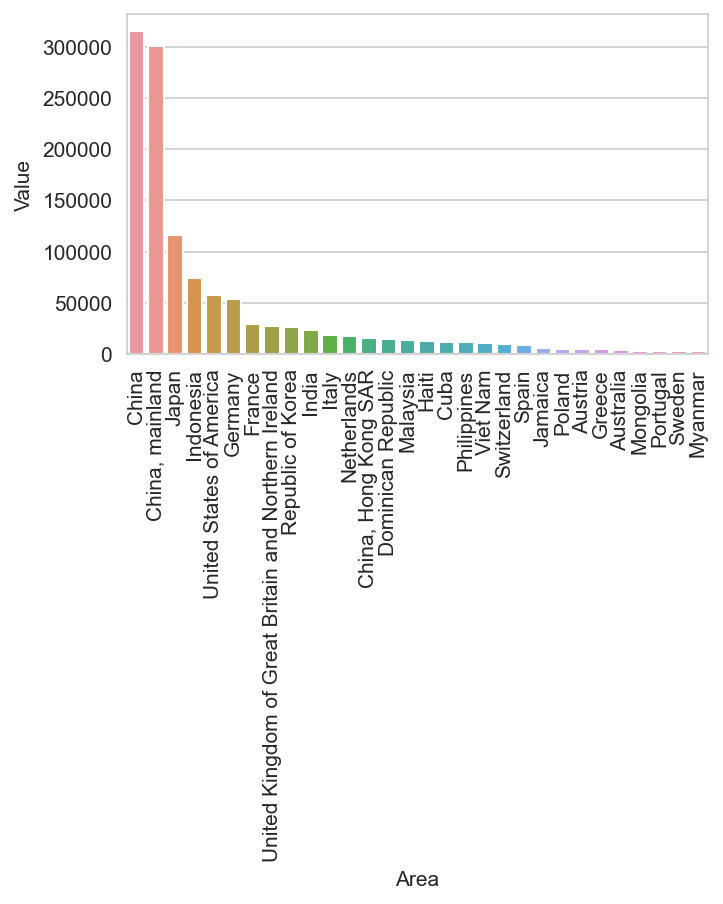
### **Boxplot of CO2 emissions**
```pyhton 
plt.figure(figsize=(5, 3), dpi=150, linewidth=2)
sns.barplot(x=s.index, y='Value', data=s)
plt.xticks(rotation=90)
plt.show()
```

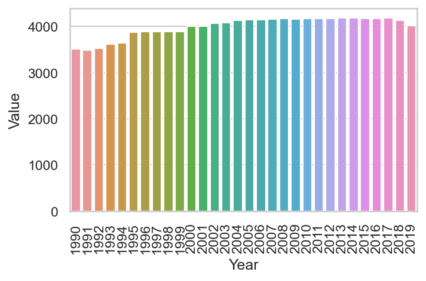

# **Top 3 countries Emissioning with graphs**
## **Ratio of CO2 over different years by China** 
```pyhton
plt.figure(figsize = (20,10))
sns.lineplot(x = "Year", y = "Value", data = df[df["Area"]=="China"])
plt.show()

```

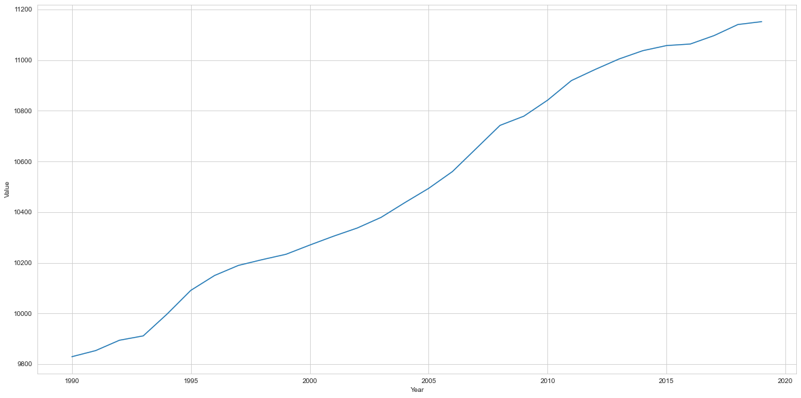
## **Ratio of CO2 over different years by Japan** 
```pyhton
plt.figure(figsize=(20, 10))
sns.lineplot(x="Year", y="Value", data=df[df["Area"] == "Japan"])
plt.show()
```

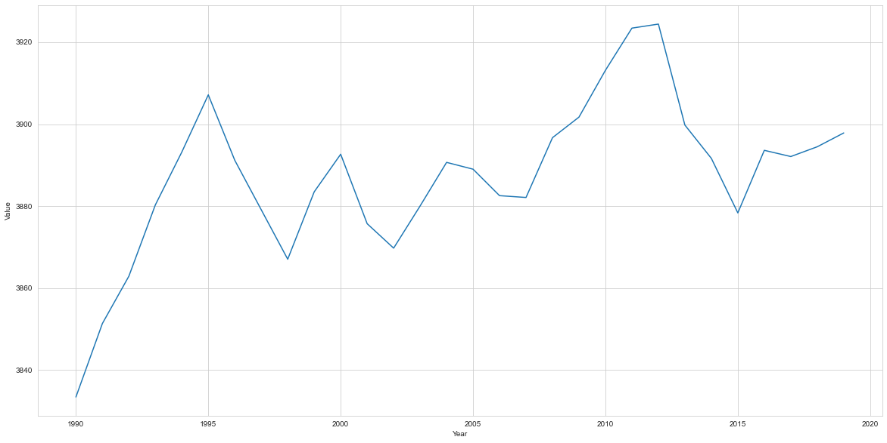

## **Ratio of CO2 over different years by China, mainland**
```pyhton**
plt.figure(figsize=(20, 10))
sns.lineplot(x="Year", y="Value", data=df[df["Area"] == "China, mainland"])
plt.show()
```

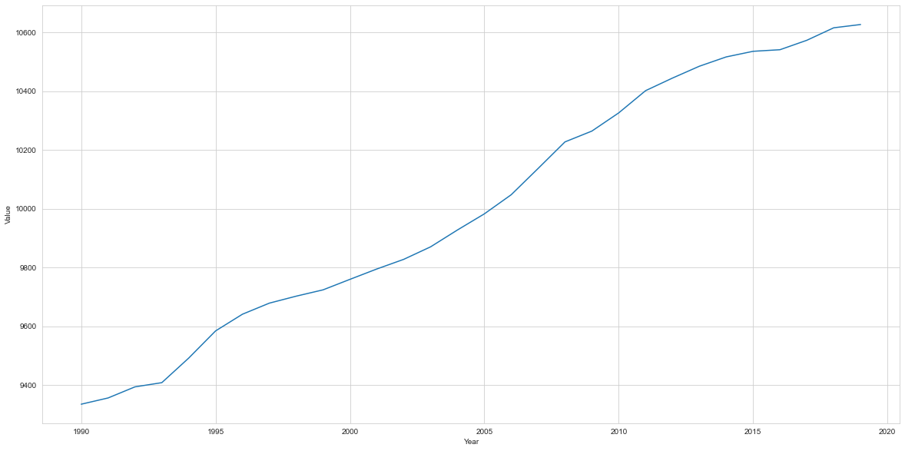


## **After label encoding and outlier removal**
visualization of CO2 emissions over the different countries.
```pyhton
countries = df['Area'].unique()
sns.set_style("whitegrid")
plt.figure(figsize=(15, 15))

for country in countries:
    sns.distplot(df[["Area","Value"]])
```

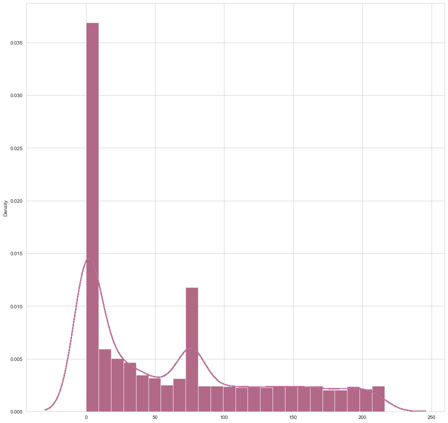


# **Part-2: EDA on Subcontinent that include Pakistan, India, and Bangladesh**
> **CO2 Emissions from Subcontinent**

In this section subcontinent countries will be examined. the list of countries are as follows:

* **Bangladesh**
* **India**
* **Pakistan**

## **Feature Selection and Data Insights**
 **Selecting Subcontinents countries**

```
df_sub = df[df["Area"].isin(["India", "Pakistan", 'Bangladesh'])]
df_sub.head()
```
 Domain Code Domain Area Code (ISO3) Area Element Code Element Item Code Item Year Code Year Unit Value Flag Flag Description
446 GW Waste Disposal BGD Bangladesh 7273 Emissions (CO2) 6990 Incineration 1990 1990 kilotonnes 46.863842 Fc Calculated data
447 GW Waste Disposal BGD Bangladesh 7273 Emissions (CO2) 6990 Incineration 1991 1991 kilotonnes 46.824124 Fc Calculated data
448 GW Waste Disposal BGD Bangladesh 7273 Emissions (CO2) 6990 Incineration 1992 1992 kilotonnes 46.870611 Fc Calculated data
449 GW Waste Disposal BGD Bangladesh 7273 Emissions (CO2) 6990 Incineration 1993 1993 kilotonnes 46.957732 Fc Calculated data
450 GW Waste Disposal BGD Bangladesh 7273 Emissions (CO2) 6990 Incineration 1994 1994 kilotonnes 46.992608 Fc Calculated data

## **Visualizing Subcontinents Countries Role in CO2 emissions**

#### Study each subcontinent Country and their Comparison. 

## **Bangladesh**

```python
df_sub[df_sub["Area"]=="Bangladesh"].groupby("Year")["Value"].mean().plot(kind="bar")
```

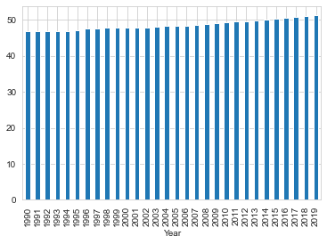

## **India**
```python
df_sub[df_sub["Area"]=="India"].groupby("Year")["Value"].mean().plot(kind="bar")
```

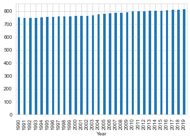

## **visualisation for india's energy usage increase over the years**

```python
plt.figure(figsize=(20, 10))
sns.lineplot(x="Year", y="Value", data=df_sub[df_sub["Area"] == "India"])
plt.show()
```
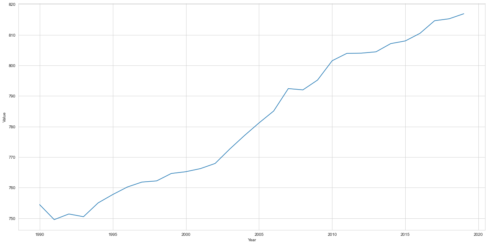

## **Pakistan**

```python
df_sub[df_sub["Area"]=="Pakistan"].groupby("Year")["Value"].mean().plot(kind="bar")
```
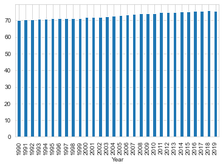

## **Combine**

```python
df_sub.groupby(['Area', 'Item'])['Value'].mean(
).unstack().plot(kind='barh', figsize=(15, 10))
```
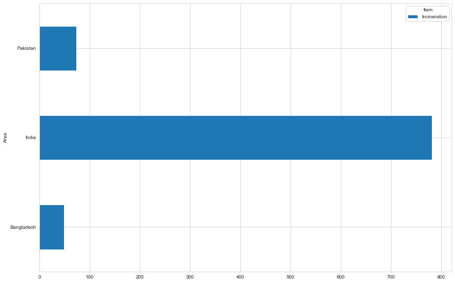

```python
plt.figure(figsize=(26, 8))
sns.lineplot(x="Year", y="Value", data=df_sub)
plt.show()
```


## **Conclusion:**

> Highest Emission Countries:
> China  2020, China, mainland   2020, Japan  2013

1. Lowest Emission (almost 0k):
 Vanuatu, Uganda, Thailand, South Africa, Senegal, Romania, Papua New Guinea, Nicaragua, Montenegro, Malawi, Lao People’s Democratic Republic, Kazakhstan, Israel, Hungary, Guam, Fiji, Denmark, Burkina Faso, Belgium Luxembourg, Azerbaijan,
2. Highest Emission (8k – 12k):
Orange Albania, Armenia, Brazil, Chile, China, Macao SAR, Czechia, El Salvador, Japan, Lithuania, Mexico, Nepal, Oman, Samoa, Slovakia, Sweden, Turkey, United States Virgin Islands, Zimbabwe, China
Purple  Algeria, Austria, Belgium, Bhutan, Bulgaria, Canada, Democratic Republic of Congo, Faroe Islands, Honduras, Isle of Man, Libya, Mauritania, Mongolia, New Zealand, Panama, Republic of Moldova, Saudi Arabia, Somalia, Tajikistan, Tuvalu, Uzbekistan
Pink  American Samoa, Bahamas, Bolivia, Colombia, Djibouti, Eritrea, Finland, Gibraltar, Guatemala, Iceland, Kenya, Latvia, Liechtenstein, Malaysia, Morocco, Niger, Paraguay, Russian Federation, Serbia, South Sudan, Timor-Leste, Ukraine, Venezuela
3. Just for knowledge:
Pakistan (Green)  between 100 and 1300
India (silver) almost 2000
Bangladesh (light green) almost 800 to 1000
Years Of Emission:
Emission is increasing day by day, but the highest emission was recorded in 2020 by China

## **Suggestions:**
* The world is releasing bulk amount of gas in atmosphere, so we need to take care of our atmospher and because it has already caused global warming as well that is current issue of the world.
* We have records of different courtiers and according to that, we may at least give them a warning or so to stop huge bulk of emission, do it but just some restrictions or we going to loss this world
* You can take recent years data and try to use different samples and different techniques. Change your perception about the comparison methodology


